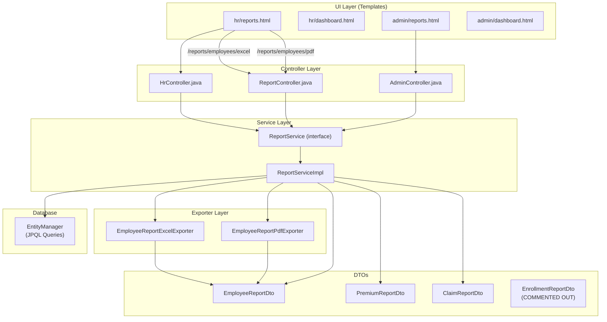
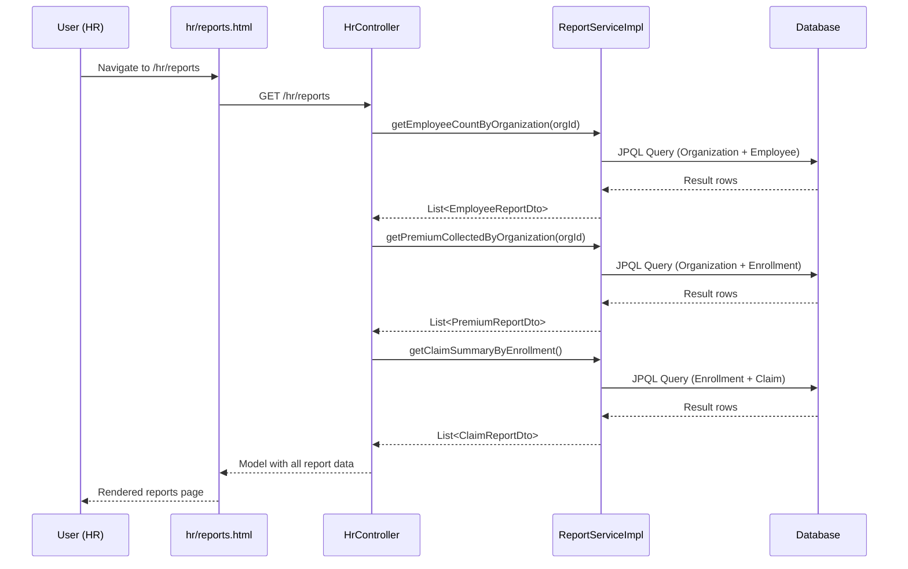
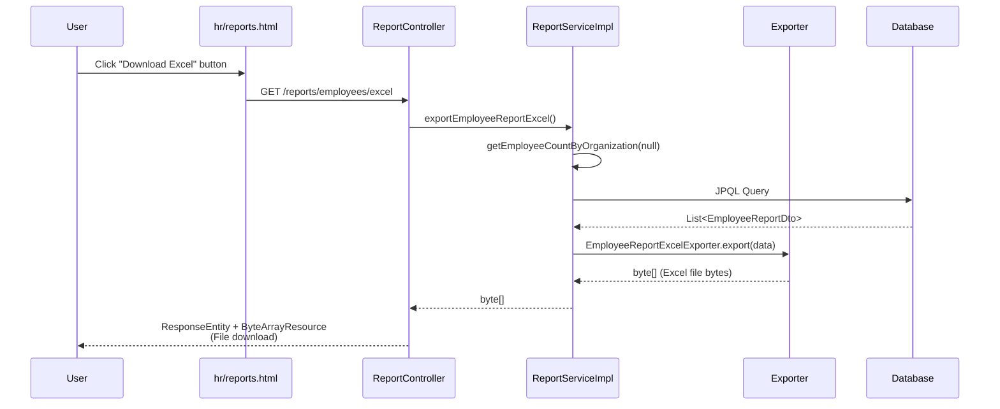

# Report Module Architecture

## Overview

The report module provides two types of functionality:
1. **Dashboard Reports** - Data displayed in HR/Admin dashboard views
2. **File Exports** - Excel/PDF downloads of employee reports

---

## Architecture Diagram



---

## Detailed Flow: Dashboard Reports

### HR Dashboard (`/hr/reports`)



---

## Detailed Flow: File Export

### Excel/PDF Download (`/reports/employees/excel` or `/reports/employees/pdf`)



---

## Component Details

### Controllers Using ReportService

| Controller | Endpoint | Methods Used | Purpose |
|------------|----------|--------------|---------|
| [HrController](file:///c:/Users/lucky/.antigravity/employee-insurance-management-master/src/main/java/com/employeeinsurancemanagement/hr/HrController.java#L233-246) | `/hr/reports` | `getEmployeeCountByOrganization`, `getPremiumCollectedByOrganization`, `getClaimSummaryByEnrollment` | HR dashboard reports |
| [AdminController](file:///c:/Users/lucky/.antigravity/employee-insurance-management-master/src/main/java/com/employeeinsurancemanagement/admin/AdminController.java#L123-146) | `/admin/reports` | Same as above | Admin dashboard reports |
| [ReportController](file:///c:/Users/lucky/.antigravity/employee-insurance-management-master/src/main/java/com/employeeinsurancemanagement/report/controller/ReportController.java) | `/reports/employees/excel`, `/reports/employees/pdf` | `exportEmployeeReportExcel`, `exportEmployeeReportPdf` | File downloads |

---

### ReportService Methods

| Method | Return Type | Used By | Status |
|--------|-------------|---------|--------|
| `getEmployeeCountByOrganization(orgId)` | `List<EmployeeReportDto>` | HrController, AdminController | ✅ ACTIVE |
| `getPremiumCollectedByOrganization(orgId)` | `List<PremiumReportDto>` | HrController, AdminController | ✅ ACTIVE |
| `getClaimSummaryByEnrollment()` | `List<ClaimReportDto>` | HrController, AdminController | ✅ ACTIVE |
| `exportEmployeeReportExcel()` | `byte[]` | ReportController | ✅ ACTIVE |
| `exportEmployeeReportPdf()` | `byte[]` | ReportController | ✅ ACTIVE |
| ~~`getEnrollmentCountByPolicy()`~~ | ~~`List<EnrollmentReportDto>`~~ | None | ❌ COMMENTED OUT |

---

### DTOs

| DTO | Fields | Used In |
|-----|--------|---------|
| [EmployeeReportDto](file:///c:/Users/lucky/.antigravity/employee-insurance-management-master/src/main/java/com/employeeinsurancemanagement/report/dto/EmployeeReportDto.java) | `organizationId`, `organizationName`, `employeeCount` | Dashboard + Export |
| [PremiumReportDto](file:///c:/Users/lucky/.antigravity/employee-insurance-management-master/src/main/java/com/employeeinsurancemanagement/report/dto/PremiumReportDto.java) | `organizationId`, `organizationName`, `totalPremiumCollected` | Dashboard only |
| [ClaimReportDto](file:///c:/Users/lucky/.antigravity/employee-insurance-management-master/src/main/java/com/employeeinsurancemanagement/report/dto/ClaimReportDto.java) | `enrollmentId`, `totalClaims`, `totalApprovedAmount` | Dashboard only |
| [EnrollmentReportDto](file:///c:/Users/lucky/.antigravity/employee-insurance-management-master/src/main/java/com/employeeinsurancemanagement/report/dto/EnrollmentReportDto.java) | `policyId`, `policyName`, `enrollmentCount` | ❌ COMMENTED OUT |

---

### Exporters

| Exporter | Output Format | Library Used |
|----------|---------------|--------------|
| [EmployeeReportExcelExporter](file:///c:/Users/lucky/.antigravity/employee-insurance-management-master/src/main/java/com/employeeinsurancemanagement/report/exporter/EmployeeReportExcelExporter.java) | `.xlsx` | Apache POI |
| [EmployeeReportPdfExporter](file:///c:/Users/lucky/.antigravity/employee-insurance-management-master/src/main/java/com/employeeinsurancemanagement/report/exporter/EmployeeReportPdfExporter.java) | `.pdf` | iText |

---

## File Structure

```
report/
├── controller/
│   └── ReportController.java      # Excel/PDF download endpoints
├── dto/
│   ├── EmployeeReportDto.java     # ✅ Active
│   ├── PremiumReportDto.java      # ✅ Active
│   ├── ClaimReportDto.java        # ✅ Active
│   └── EnrollmentReportDto.java   # ❌ Commented out
├── exporter/
│   ├── EmployeeReportExcelExporter.java  # ✅ Active
│   └── EmployeeReportPdfExporter.java    # ✅ Active
└── service/
    ├── ReportService.java         # Interface
    └── ReportServiceImpl.java     # Implementation
```

---

## UI Integration Points

### hr/reports.html (lines 99-105)

```html
<!-- Excel Download -->
<a th:href="@{/reports/employees/excel}" class="btn btn-success btn-sm">
    Download Excel
</a>

<!-- PDF Download -->
<a th:href="@{/reports/employees/pdf}" class="btn btn-danger btn-sm">
    Download PDF
</a>
```

These buttons trigger file downloads via [ReportController](file:///c:/Users/lucky/.antigravity/employee-insurance-management-master/src/main/java/com/employeeinsurancemanagement/report/controller/ReportController.java).
