```mermaid
flowchart LR
    subgraph CONTROLLER
        C["model.addAttribute('employeeCreateRequest', new EmployeeCreateRequest())"]
    end
    
    subgraph TEMPLATE
        F["th:object='${employeeCreateRequest}'"]
        E["*{email} → employeeCreateRequest.email"]
        A["*{address.city} → employeeCreateRequest.address.city"]
    end
    
    C --> F
    F --> E
    F --> A
```

# Thymeleaf Integration with Spring MVC - Complete Guide

## Overview

Thymeleaf is a **server-side Java template engine** that renders HTML on the server before sending it to the browser. This document explains:
1. **How Thymeleaf Integrates with Spring**
2. **All Thymeleaf Attributes (th:*) Used in Your Project**
3. **Expression Syntax ($, *, @, #)**
4. **Form Binding and Validation**
5. **Complete Request-Response Cycle**

---

## Part 1: Thymeleaf Integration Architecture

### How Spring + Thymeleaf Work Together


---

### The View Resolution Process


---

## Part 2: Your Controller → View Data Flow

### Example: HR Employees List

```java
// HrController.java
@GetMapping("/employees")
public String employees(Model model) {
    User currentUser = getCurrentUser();
    Long orgId = currentUser.getOrganization().getOrganizationId();

    List<Employee> employees = employeeRepository.findAll().stream()
            .filter(e -> e.getOrganization().getOrganizationId().equals(orgId))
            .collect(Collectors.toList());

    // Add data to Model - these become available in template
    model.addAttribute("employees", employees);
    model.addAttribute("organizationId", orgId);
    model.addAttribute("organizationName", currentUser.getOrganization().getOrganizationName());
    model.addAttribute("adminContact", getAdminContact());

    return "hr/employees";  // → templates/hr/employees.html
}
```


---

## Part 3: All Thymeleaf Attributes Used in Your Project

### Quick Reference Table

| Attribute | Purpose | Example |
|-----------|---------|---------|
| `th:text` | Set text content | `<span th:text="${emp.name}">` |
| `th:if` | Conditional rendering | `<div th:if="${error}">` |
| `th:unless` | Inverse conditional | `<div th:unless="${list.empty}">` |
| `th:each` | Loop iteration | `<tr th:each="emp : ${employees}">` |
| `th:href` | Dynamic URL | `<a th:href="@{/hr/employees}">` |
| `th:action` | Form action URL | `<form th:action="@{/login}">` |
| `th:object` | Form binding object | `<form th:object="${employeeDto}">` |
| `th:field` | Form field binding | `<input th:field="*{email}">` |
| `th:errors` | Validation errors | `<div th:errors="*{email}">` |
| `th:classappend` | Conditional CSS class | `th:classappend="${error} ? 'is-invalid'"` |
| `th:id` | Dynamic ID | `th:id="'modal' + ${emp.id}"` |
| `th:data-*` | Data attributes | `th:data-bs-target="'#modal' + ${id}"` |

---

## Part 4: Expression Syntax Deep Dive

### Four Types of Expressions

| Expression | Syntax | Purpose | Example |
|------------|--------|---------|---------|
| **Variable** | `${...}` | Access model attributes | `${employees}` |
| **Selection** | `*{...}` | Access fields of bound object | `*{email}` |
| **URL** | `@{...}` | Build URLs (context-aware) | `@{/hr/employees}` |
| **Utility** | `#{...}` | Message/i18n (not used in your project) | `#{welcome.message}` |

---

### 1. Variable Expression: `${...}`

Access data from the Model object:

```html
<!-- Simple value -->
<h2 th:text="${organizationName}">Default Organization</h2>

<!-- Object property -->
<td th:text="${emp.employeeName}">John Doe</td>

<!-- Nested property -->
<td th:text="${emp.organization.organizationName}">Company</td>

<!-- Method call -->
<span th:text="${emp.status.toString()}">STATUS</span>

<!-- Conditional check -->
<div th:if="${emp.status.toString() == 'ACTIVE'}">Active!</div>
```

---

### 2. Selection Expression: `*{...}` (Form Binding)

Used within `th:object` to access properties of the bound object:

```html
<!-- th:object binds the form to employeeCreateRequest -->
<form th:action="@{/hr/create-employee}" 
      th:object="${employeeCreateRequest}">
    
    <!-- *{email} is equivalent to ${employeeCreateRequest.email} -->
    <input type="email" th:field="*{email}">
    
    <!-- Nested object property -->
    <input type="text" th:field="*{address.city}">
    
    <!-- Validation errors for this field -->
    <div th:errors="*{email}">Email error</div>
</form>
```



---

### 3. URL Expression: `@{...}`

Build URLs with context path and parameters:

```html
<!-- Simple URL -->
<a th:href="@{/hr/employees}">Employees</a>
<!-- Output: /hr/employees -->

<!-- URL with path variable -->
<a th:href="@{/hr/employees/{id}(id=${emp.employeeId})}">View</a>
<!-- Output: /hr/employees/42 -->

<!-- URL with query parameters -->
<a th:href="@{/hr/employees(status='ACTIVE', page=${currentPage})}">Active</a>
<!-- Output: /hr/employees?status=ACTIVE&page=1 -->

<!-- Form action -->
<form th:action="@{/hr/employees/{id}/resign(id=${emp.employeeId})}" method="post">
<!-- Output: /hr/employees/42/resign -->
```

---

### 4. Utility Objects: `#...`

Built-in utility objects for common operations:

```html
<!-- #temporals - Date/Time utilities -->
<input type="date" 
       th:max="${#temporals.format(#temporals.createNow().minusYears(18), 'yyyy-MM-dd')}">

<!-- #fields - Form field utilities -->
<div th:if="${#fields.hasErrors('email')}">Has errors!</div>
<div th:each="err : ${#fields.errors('*')}">All errors</div>

<!-- #strings - String utilities -->
<span th:text="${#strings.toUpperCase(emp.name)}">NAME</span>

<!-- #lists - List utilities -->
<div th:if="${#lists.isEmpty(employees)}">No employees</div>

<!-- #numbers - Number formatting -->
<span th:text="${#numbers.formatCurrency(premium)}">₹0.00</span>
```

---

## Part 5: Iteration with `th:each`

### Basic Iteration

```html
<table>
    <tbody>
        <!-- Iterate over employees list -->
        <tr th:each="emp : ${employees}">
            <td th:text="${emp.employeeCode}">EMP001</td>
            <td th:text="${emp.employeeName}">John</td>
            <td th:text="${emp.email}">john@example.com</td>
        </tr>
    </tbody>
</table>
```

### Iteration with Status Variable

```html
<tr th:each="emp, status : ${employees}">
    <td th:text="${status.index}">0</td>        <!-- 0, 1, 2... -->
    <td th:text="${status.count}">1</td>        <!-- 1, 2, 3... -->
    <td th:text="${status.first}">true</td>     <!-- true if first -->
    <td th:text="${status.last}">false</td>     <!-- true if last -->
    <td th:text="${status.odd}">false</td>      <!-- true if odd row -->
    <td th:text="${status.even}">true</td>      <!-- true if even row -->
    <td th:text="${emp.employeeName}">Name</td>
</tr>
```


---

## Part 6: Conditional Rendering

### `th:if` - Show if True

```html
<!-- Show error alert only if error exists -->
<div th:if="${error}" class="alert alert-danger" th:text="${error}">
    Error message here
</div>

<!-- Show success message only if success exists -->
<div th:if="${success}" class="alert alert-success" th:text="${success}">
    Success message here
</div>

<!-- Conditional based on enum value -->
<span class="badge bg-success" 
      th:if="${emp.status.toString() == 'ACTIVE'}">ACTIVE</span>
<span class="badge bg-warning" 
      th:if="${emp.status.toString() == 'NOTICE'}">NOTICE</span>
<span class="badge bg-danger" 
      th:if="${emp.status.toString() == 'EXITED'}">EXITED</span>
```

### `th:unless` - Show if False

```html
<!-- Show only if list is NOT empty -->
<table th:unless="${#lists.isEmpty(employees)}">
    ...
</table>

<!-- Show empty message only if list IS empty -->
<p th:if="${#lists.isEmpty(employees)}">No employees found.</p>
```

### Conditional Actions

```html
<!-- Show "Resign" button only for ACTIVE employees -->
<button th:if="${emp.status.toString() == 'ACTIVE'}" 
        class="btn btn-danger">
    Resign
</button>

<!-- Show "Exit" button only for NOTICE employees -->
<form th:if="${emp.status.toString() == 'NOTICE'}"
      th:action="@{/hr/employees/{id}/exit(id=${emp.employeeId})}" 
      method="post">
    <button type="submit" class="btn btn-dark">Exit</button>
</form>
```

---

## Part 7: Form Handling

### Complete Form Flow


---

### Form Binding with `th:object` and `th:field`

```html
<!-- Controller provides: model.addAttribute("employeeCreateRequest", dto) -->
<form th:action="@{/hr/create-employee}" 
      method="post" 
      th:object="${employeeCreateRequest}">
    
    <!-- th:field generates: id, name, and value attributes -->
    <input type="text" th:field="*{employeeName}">
    <!-- Renders as: <input id="employeeName" name="employeeName" value=""> -->
    
    <input type="email" th:field="*{email}">
    <!-- Renders as: <input id="email" name="email" value=""> -->
    
    <!-- Nested object binding -->
    <input type="text" th:field="*{address.city}">
    <!-- Renders as: <input id="address.city" name="address.city" value=""> -->
    
    <button type="submit">Create</button>
</form>
```

---

### Validation Error Display

```html
<form th:object="${employeeCreateRequest}">
    
    <!-- Field with validation -->
    <div class="mb-3">
        <label for="email" class="form-label">Email *</label>
        
        <!-- Add 'is-invalid' class if field has errors -->
        <input type="email" 
               th:field="*{email}"
               th:classappend="${#fields.hasErrors('email')} ? 'is-invalid'"
               required>
        
        <!-- Show error message if field has errors -->
        <div class="invalid-feedback" 
             th:if="${#fields.hasErrors('email')}"
             th:errors="*{email}">
            Email error message
        </div>
    </div>
</form>
```


---

## Part 8: CSRF Token Integration

### Automatic CSRF with `th:action`

```html
<!-- Using th:action automatically adds CSRF token -->
<form th:action="@{/hr/create-employee}" method="post">
    ...
</form>

<!-- Thymeleaf renders this as: -->
<form action="/hr/create-employee" method="post">
    <input type="hidden" name="_csrf" value="abc123xyz"/>
    ...
</form>
```

### How It Works

```mermaid
sequenceDiagram
    participant B as Browser
    participant T as Thymeleaf
    participant SC as Spring Security
    participant S as Server

    B->>S: GET /hr/create-employee
    S->>SC: Generate CSRF token
    SC-->>T: CsrfToken object
    T->>T: Process th:action<br/>Add hidden _csrf field
    T-->>B: <form>...<input name="_csrf" value="token">...</form>
    
    B->>S: POST /hr/create-employee<br/>_csrf=token
    S->>SC: Validate CSRF token
    SC-->>S: Valid ✓
    S->>S: Process request
```



---

## Part 9: Dynamic IDs and Modal Pattern

### Your Modal Pattern (from employees.html)

```html
<!-- Generate unique modal for each employee -->
<div th:each="emp : ${employees}">
    
    <!-- Button to trigger modal -->
    <button type="button" 
            data-bs-toggle="modal"
            th:data-bs-target="'#resignModal' + ${emp.employeeId}">
        Resign
    </button>
    
    <!-- Modal with dynamic ID -->
    <div class="modal fade" 
         th:id="'resignModal' + ${emp.employeeId}" 
         tabindex="-1">
        <div class="modal-dialog">
            <form th:action="@{/hr/employees/{id}/resign(id=${emp.employeeId})}" 
                  method="post">
                <p>Employee: <strong th:text="${emp.employeeName}"></strong></p>
                <input type="date" name="resignationDate" required>
                <button type="submit">Confirm Resignation</button>
            </form>
        </div>
    </div>
</div>
```

**Rendered Output:**
```html
<!-- For employee 1 -->
<button data-bs-target="#resignModal42">Resign</button>
<div id="resignModal42" class="modal fade">...</div>

<!-- For employee 2 -->
<button data-bs-target="#resignModal43">Resign</button>
<div id="resignModal43" class="modal fade">...</div>
```

---

## Part 10: Date/Time Utilities

### Using `#temporals`

```html
<!-- Current date -->
<span th:text="${#temporals.format(#temporals.createNow(), 'yyyy-MM-dd')}">
    2026-02-04
</span>

<!-- Format date from model -->
<span th:text="${#temporals.format(emp.joiningDate, 'dd MMM yyyy')}">
    04 Feb 2024
</span>

<!-- Date constraints for input -->
<input type="date" 
       th:field="*{dateOfBirth}"
       th:max="${#temporals.format(#temporals.createNow().minusYears(18), 'yyyy-MM-dd')}"
       th:min="${#temporals.format(#temporals.createNow().minusYears(70), 'yyyy-MM-dd')}">
<!-- Sets max to 18 years ago, min to 70 years ago -->
```

---

## Part 11: Conditional CSS Classes

### Using `th:classappend`

```html
<!-- Add 'is-invalid' class if field has errors -->
<input type="email" 
       th:field="*{email}"
       class="form-control"
       th:classappend="${#fields.hasErrors('email')} ? 'is-invalid'">

<!-- Conditional row highlighting -->
<tr th:each="emp : ${employees}"
    th:classappend="${emp.status.toString() == 'EXITED'} ? 'table-danger'">
```

### Using Inline Conditional

```html
<!-- Ternary operator in th:class -->
<span th:class="${emp.status.toString() == 'ACTIVE'} ? 'badge bg-success' : 
                 ${emp.status.toString() == 'NOTICE'} ? 'badge bg-warning' : 
                 'badge bg-danger'">
    Status Badge
</span>
```

---

## Part 12: Complete Rendering Cycle

```mermaid
flowchart TD
    A["1️⃣ Browser: GET /hr/employees"] --> B["2️⃣ DispatcherServlet receives request"]
    B --> C["3️⃣ HandlerMapping finds HrController.employees()"]
    C --> D["4️⃣ Controller executes, populates Model"]
    D --> E["5️⃣ Controller returns 'hr/employees'"]
    E --> F["6️⃣ ThymeleafViewResolver resolves template"]
    F --> G["7️⃣ Template: templates/hr/employees.html"]
    G --> H["8️⃣ Thymeleaf Engine parses template"]
    H --> I["9️⃣ Process th:* attributes"]
    I --> J["🔟 Replace ${} with Model values"]
    J --> K["1️⃣1️⃣ Build URL expressions @{}"]
    K --> L["1️⃣2️⃣ Evaluate conditions th:if"]
    L --> M["1️⃣3️⃣ Iterate th:each loops"]
    M --> N["1️⃣4️⃣ Add CSRF tokens to forms"]
    N --> O["1️⃣5️⃣ Generate final HTML"]
    O --> P["1️⃣6️⃣ Response sent to browser"]
```



---

## Summary: Templates in Your Project

| Template | Model Attributes | Key Thymeleaf Features |
|----------|-----------------|------------------------|
| `auth/login.html` | `error`, `message` | `th:if`, `th:action`, CSRF |
| `hr/create-employee.html` | `employeeCreateRequest`, `error` | `th:object`, `th:field`, `th:errors`, validation |
| `hr/employees.html` | `employees`, `success`, `error` | `th:each`, `th:if`, modal pattern |
| `hr/enrollments.html` | `enrollments` | `th:each`, status badges |
| `hr/claims.html` | `allClaims`, `pendingClaims` | `th:each`, conditional rendering |
| `admin/dashboard.html` | counts, `pendingClaims` | Stats display, `th:text` |
| `employee/profile.html` | `employee`, `fieldsEditable` | Conditional form fields |

---

## Key Takeaways

1. **`${...}`** - Access Model data
2. **`*{...}`** - Access bound form object fields
3. **`@{...}`** - Build URLs (with path variables & params)
4. **`th:if` / `th:unless`** - Conditional rendering
5. **`th:each`** - Iteration
6. **`th:object` + `th:field`** - Two-way form binding
7. **`th:errors`** - Show validation errors
8. **`th:action`** - Form submission with auto CSRF
9. **`#fields`** - Check for validation errors
10. **`#temporals`** - Date/Time formatting
