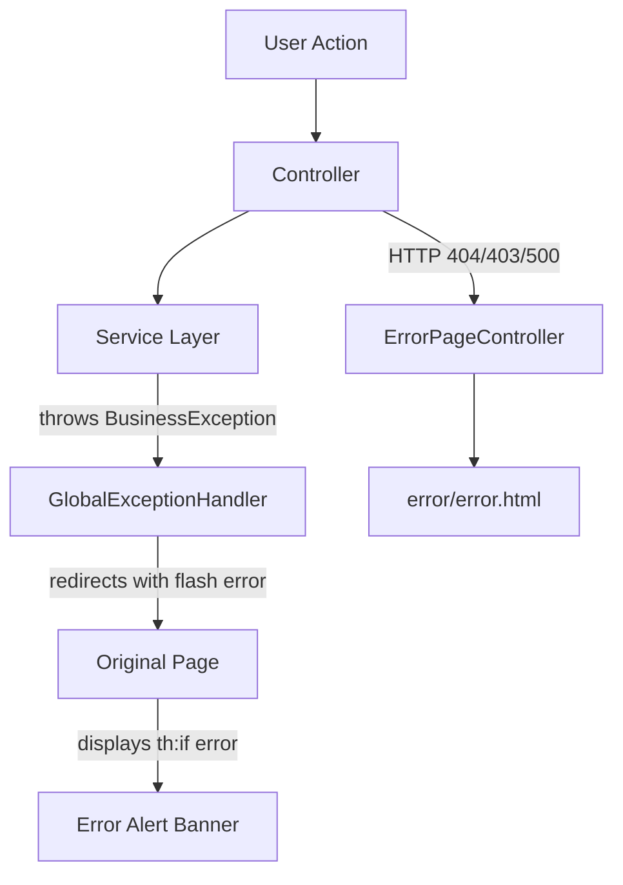

# Exception Handling Fix - Walkthrough

## Summary

Fixed the global exception handler to properly integrate with the MVC-based UI. Business exceptions now display as error messages on the appropriate pages.

## Changes Made

### [GlobalExceptionHandler.java](file:///c:/Users/lucky/.antigravity/employee-insurance-management-master/src/main/java/com/employeeinsurancemanagement/exception/GlobalExceptionHandler.java)

**Before:** Commented out REST API handler using `@RestControllerAdvice` returning `ResponseEntity<ApiError>`

**After:** Active MVC handler using `@ControllerAdvice` that:

| Exception Type | Behavior |
|----------------|----------|
| `BusinessException` | Redirects back to referer with error in flash attributes |
| `ResourceNotFoundException` | Redirects to `/dashboard` with error message |
| `Exception` (fallback) | Redirects to `/dashboard` with generic error message |

render_diffs(file:///c:/Users/lucky/.antigravity/employee-insurance-management-master/src/main/java/com/employeeinsurancemanagement/exception/GlobalExceptionHandler.java)

---

## Architecture

---

## Key Files

| File | Purpose |
|------|---------|
| [GlobalExceptionHandler.java](file:///c:/Users/lucky/.antigravity/employee-insurance-management-master/src/main/java/com/employeeinsurancemanagement/exception/GlobalExceptionHandler.java) | Catches application exceptions, redirects with flash attributes |
| [ErrorPageController.java](file:///c:/Users/lucky/.antigravity/employee-insurance-management-master/src/main/java/com/employeeinsurancemanagement/controller/ErrorPageController.java) | Handles HTTP-level errors (404, 403, 500) |
| [ApiError.java](file:///c:/Users/lucky/.antigravity/employee-insurance-management-master/src/main/java/com/employeeinsurancemanagement/exception/ApiError.java) | Not used (commented out) - was for REST API |
| [BusinessException.java](file:///c:/Users/lucky/.antigravity/employee-insurance-management-master/src/main/java/com/employeeinsurancemanagement/exception/BusinessException.java) | Custom exception for business rule violations |
| [ResourceNotFoundException.java](file:///c:/Users/lucky/.antigravity/employee-insurance-management-master/src/main/java/com/employeeinsurancemanagement/exception/ResourceNotFoundException.java) | Custom exception for missing resources |

---

## How Business Exceptions Work Now

1. Service throws `BusinessException` (e.g., "Maximum two policies allowed per employee")
2. `GlobalExceptionHandler.handleBusinessException()` catches it
3. Error message is added to flash attributes: `redirectAttributes.addFlashAttribute("error", ex.getMessage())`
4. User is redirected back to the referer page (or `/dashboard` if no referer)
5. Thymeleaf template displays the error: `

`

---

## Verification

To verify the changes work:

1. **Restart the application** (if running) to pick up the new handler
2. **Test a business exception scenario:**
   - Go to employee enrollment form
   - Try to add more than 8 dependents
   - The error "Maximum 8 dependents allowed" should appear as a red alert

3. **Test a 404 error:**
   - Navigate to a non-existent URL like `/nonexistent`
   - Should see the generic error page from ErrorPageController
